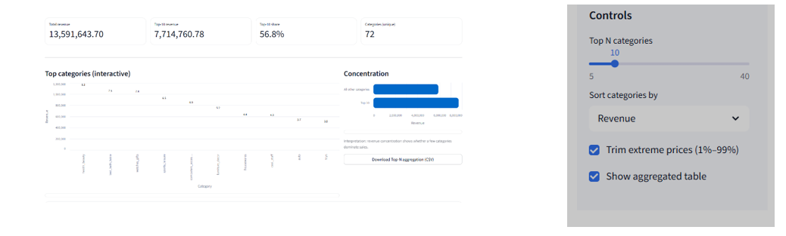
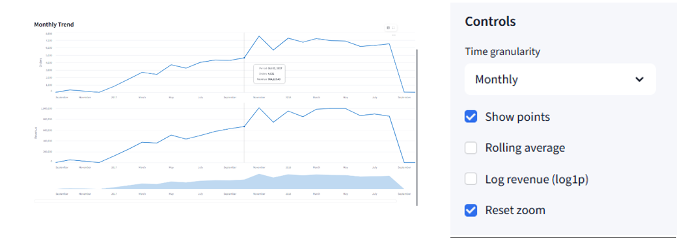
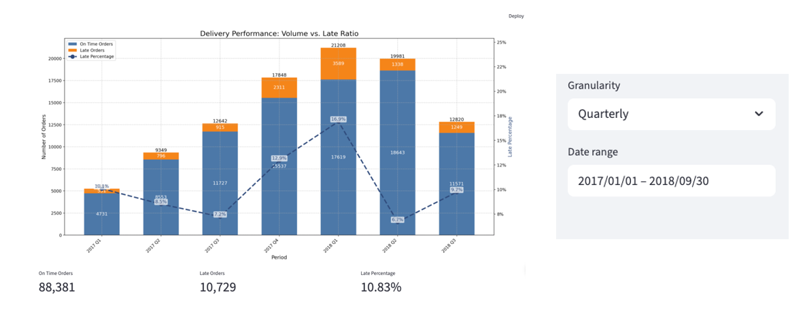
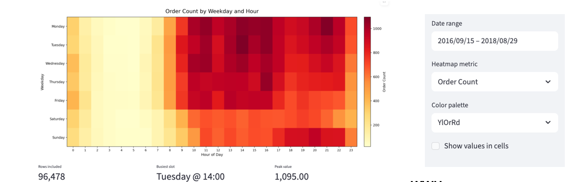
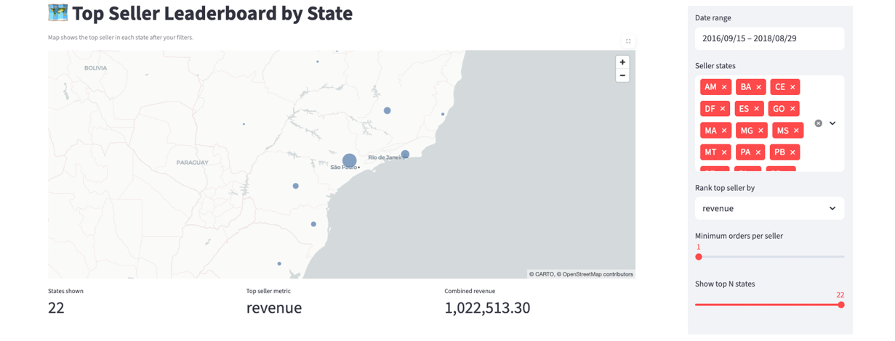
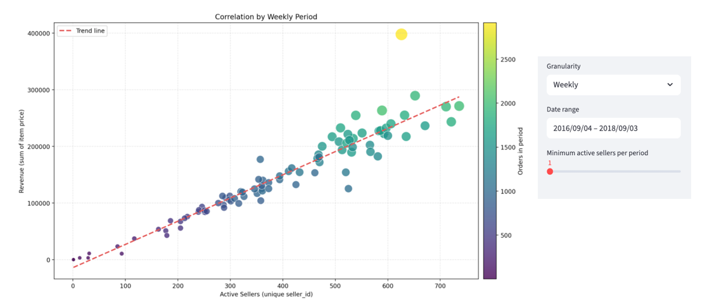
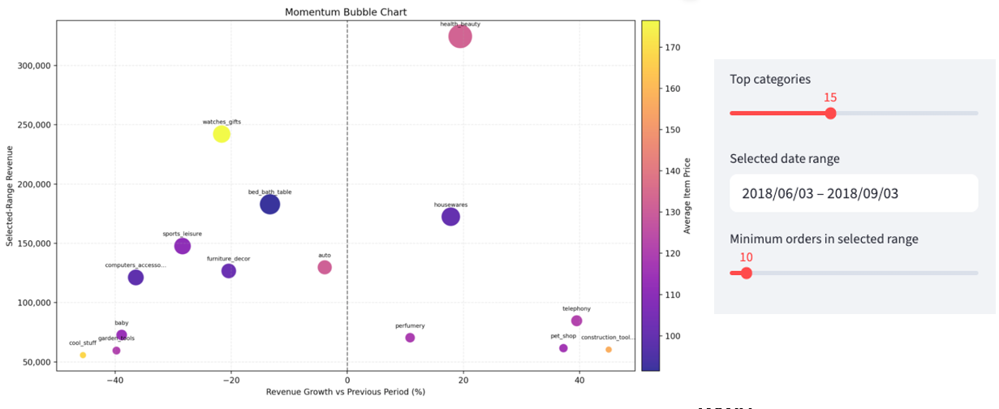

# 📊 דוח מסכם - ויזואליזציה של המידע

## Olist E-Commerce Platform

**קורס:** ויזואליזציה של המידע\
**מרצה:** פרופ׳ גלעד רביד

**מגישים:**
- אוהד אשכנזי
- מלאכי ויס

------------------------------------------------------------------------

מצורף כאן סיכום תמציתי של הפרויקט. המידע המלא נמצא בדו"ח visualization_report.pdf

# 📂 תיאור הנתונים ואופן הטיפול

הפרויקט מבוסס על מאגר הנתונים הציבורי של פלטפורמת האיקומרס הברזילאית
**Olist**, הכולל מידע רב־ממדי על:

-   הזמנות
-   פריטים
-   קטגוריות מוצרים
-   מוכרים
-   משלוחים
-   חותמות זמן
-   מידע גיאוגרפי

שלבי עיבוד מרכזיים:

-   מיזוג טבלאות (Join)
-   ניקוי ערכים חסרים וחריגים
-   אגרגציה לפי שבוע / חודש
-   חישוב מדדים נגזרים (Revenue, Growth, Delay Rate וכו')

------------------------------------------------------------------------

# 📊 ויזואליזציה ראשונה

## Pareto -- ריכוזיות הכנסות לפי קטגוריה

  

------------------------------------------------------------------------

# 📈 ויזואליזציה שנייה

## Orders & Revenue Over Time -- Small Multiples

  

### שאלה עסקית

------------------------------------------------------------------------

# 📦 ויזואליזציה שלישית

## Shipping Performance

  

------------------------------------------------------------------------

# 🔥 ויזואליזציה רביעית

## Heatmap

  

------------------------------------------------------------------------

# 🗺 ויזואליזציה חמישית

## Proportional Symbol Map

  

------------------------------------------------------------------------

# 📉 ויזואליזציה שישית

## Scatterplot

  

------------------------------------------------------------------------

# 🔵 ויזואליזציה שביעית

## Bubble Chart

  

------------------------------------------------------------------------
